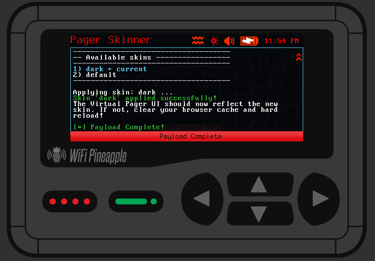

# Amilious Virtual Pager Skinner

This payload can be used to apply skins to the virtual pager.  A ***Dark Skin*** is included, but additional skins can be added.  The original skin will be coppied to the default directory in the ui_skins directory.

    

---

### WHERE DO I PUT SKINS

    Skins can be placed in the /mmc/root/ui_skins directory.

---

### THE SKIN DID NOT CHANGE

    You need to clear your browser cache and do a hard reload.  In most browsers you can do this by pressing F12 to open developer mode then right click the refresh icon.

---

I will update this to use the list picker when it is made available!